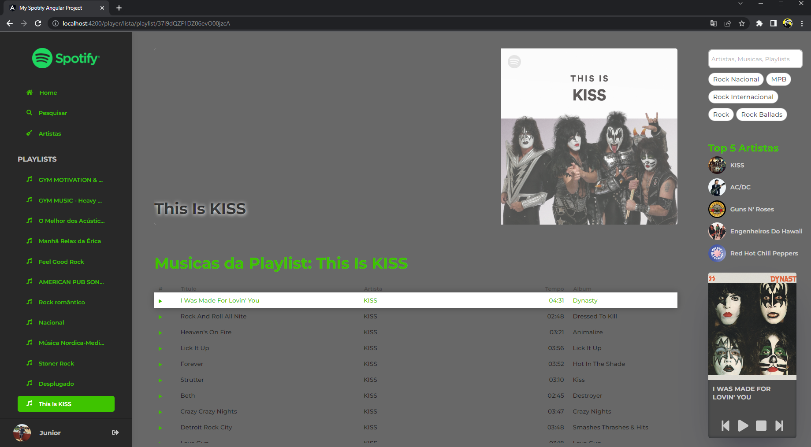

# My Spotify - Angular Project

O projeto consiste em uma página que consome e trata os dados da API do Spotify após autorização para controlar e ler os dados da conta de um usuário, criando uma interface personalizada para controlar a reprodução das músicas e playlists que o usuário segue na plataforma de streaming.  
Este projeto foi inicialmente construido e compartilhado no canal do YouTube do [Cristian William](https://github.com/cristianWilliam), eu acompanhei as aulas, fiz algumas mudanças por problemas causados por atualizações do Angular, alguns componentes depreciados e por conta de atualizações do próprio Spotify, além de reestilizar o layout para algo mais agradavél ao meu estilo de desenvolvimento frontend.  
Os dados exibidos na página dependem totalmente das informações fornecidas pelo Spotify, sendo assim o conteúdo é dinamico e personalizado para cada usuário que acessar.  
O token fornecido pelo Spotify tem duração de uma hora, e não permite apagar, modificar ou seguir playlists, artistas ou musicas.  

### Demonstração

⚠ Para funcionamento é necessário fazer login com sua conta do Spotify.  
Recomenda-se o acesso via computador, o projeto não conta com regras de responsividade. 
Não foram feitos teste de responsividade com dispositivos mobile. 
Você pode ver a aplicação clicando no icone da Vercel abaixo:

      

## 🛠 Skills Desenvolvidas

 

## 🚀 Sobre mim
Olá, eu sou o Junior!

Sou graduando em Analise e Desenvolvimento de Sistemas pela Universidade Paulista (UNIP). Me especializando em frontend com HTML, CSS, Boostrap, JavaScript, TypeScript e React que são as ferramentas que atualmente mais uso no meu cotidiano. Tenho experiência em desenvolvimento de sites responsivos buscando o melhor desempenho nos diferentes dispositivos.

## 🔗 Links

